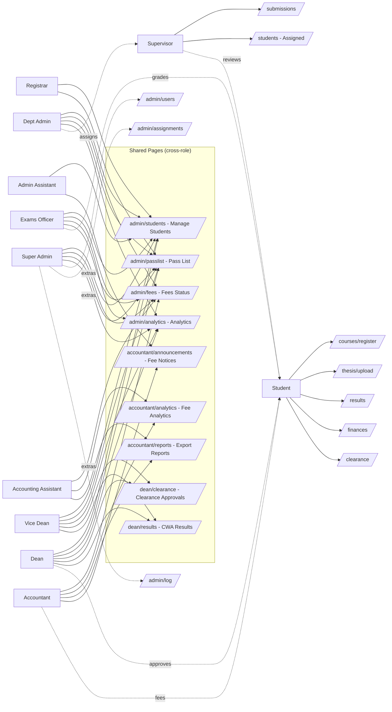

# UMaT SPS — System Overview: Roles, Shared Pages & Data

## 1. User Roles (defined in `AuthContext.tsx`)

| Role | Tier | Scope |
|---|---|---|
| **Student** | End-user | Own records only |
| **Supervisor** | Staff | Assigned students only |
| **Admin** (Departmental) | Staff | One department |
| **Admin** with `isSuperAdmin: true` | Global | Entire school |
| **Dean** / **ViceDean** | Global | All departments (academic) |
| **Registrar** | Global | Student records |
| **AdminAssistant** | Global | Support admin |
| **Accountant** / **AccountingAssistant** | Global | Finance |
| **ExamsOfficer** | Global | Grades & results |

Role is derived from the **email prefix** (e.g. `supervisor.*`, `dean.*`, `admin.cs`, `superadmin`, `accountant.*`, `exams.*`). Any password is accepted (mock auth).

---

## 2. Page ↔ Role Matrix (from `Sidebar.tsx` + `App.tsx` routes)

### Student-only pages
`/courses/register` · `/thesis/upload` · `/results` · `/finances` · `/documents` · `/clearance` · `/student/chat` · `/notifications`

### Supervisor-only pages
`/students` (Assigned) · `/submissions` · `/supervisor/templates` · `/supervisor/ai`

### Exams Officer-only pages
`/exams/grades` · `/exams/passlist` · `/exams/publish`

### Dean-only pages
`/dean/clearance` · `/dean/results` (CWA)

### Accountant-only pages
`/accountant/analytics` · `/accountant/reports` · `/accountant/announcements`

### Super-Admin exclusive (appended to any Admin with `isSuperAdmin`)
`/admin/users` · `/admin/assignments` · `/admin/log`

### 🔁 Shared pages (same route, multiple roles)

| Route | Used by |
|---|---|
| `/dashboard` | **All roles** (content branches on `user.role` in `Dashboard.tsx`) |
| `/admin/students` (Manage Students) | Admin, Dean, ViceDean, Registrar, AdminAssistant, ExamsOfficer |
| `/admin/fees` (Fees Status) | Admin, Accountant, AccountingAssistant, ExamsOfficer |
| `/admin/passlist` | Admin, Dean, ViceDean, Registrar, ExamsOfficer |
| `/admin/analytics` | Admin, Dean, ViceDean, ExamsOfficer |
| `/accountant/analytics` (Fee Analytics) | Accountant, AccountingAssistant |
| `/accountant/reports` | Accountant, AccountingAssistant |
| `/accountant/announcements` (Fee Notices) | Accountant, AdminAssistant |
| `/dean/clearance` | Dean, ViceDean |
| `/dean/results` (CWA) | Dean, ViceDean |

> ⚠️ Route protection is currently **`RequireAuth` only** — there is **no per-role route guard**, so any authenticated user who knows a URL can load it. The sidebar is the only thing hiding routes.

---

## 3. Shared Data Layer

Two global providers wrap the whole app (`App.tsx`):

### `AuthContext` — *who is logged in*
- Stores the `User` in `localStorage` (`umat_sps_auth_user`).
- Every page reads `useAuth()` to branch UI on `user.role` and `user.isSuperAdmin`.

### `DataStoreContext` — *administrative state shared across roles*
In-memory store (mock) holding:
- `students` — created by Admin, read by Supervisor / Dean / Exams / Accountant
- `supervisors` — created by Super Admin, read on assignment screens
- `systemUsers` — managed by Super Admin (`/admin/users`)
- `assignments` (student ↔ supervisor) — created by Admin (`/admin/assignments`), read by Supervisor (`/students`, `/submissions`)
- `graduands` — pushed by Exams Officer, read by Dean / Admin pass lists

### `thesis_submissions` (Supabase / Lovable Cloud)
The only real persisted table. Cross-role pipeline:

```
Student (/thesis/upload)
   │  INSERT row (status=Pending, file in `thesis-files` bucket)
   ▼
Supervisor (/submissions)
   │  UPDATE status/feedback/reviewed_by/reviewed_at
   ▼
Dean (/dean/clearance)  ← reads approved submissions for clearance gate
```

---

## 4. Cross-Role Relationships (who depends on whom)

```
Super Admin  ──creates──▶ System Users, Supervisors, Departments
Dept Admin   ──enrolls──▶ Students  ──assigns──▶ Supervisor
Student      ──uploads──▶ Thesis Submission  ──reviewed by──▶ Supervisor
Supervisor   ──approves─▶ Submission status  ──visible to──▶ Dean, Admin
Exams Officer──enters───▶ Grades → CWA  ──visible to──▶ Dean, Student (/results), Admin
Accountant   ──posts────▶ Fees/Payments  ──visible to──▶ Student (/finances), Admin, Dean (clearance)
Dean         ──approves─▶ Clearance  ──unlocks──▶ Student documents, transcript, graduation
```

---

## 5. Pages That Change Behavior by Role (same file, role-aware)

- **`Dashboard.tsx`** — different stat cards & quick actions per `user.role`; Super Admin sees extra system widgets.
- **`/admin/students`** — Department Admin sees only their department (via `useAdminDepartment`); Super Admin/Dean/Exams see all.
- **`/admin/fees`** — Accountant gets edit controls; ExamsOfficer & Admin get read-only.
- **`/admin/analytics`** — Dean sees academic KPIs; Admin sees enrollment; ExamsOfficer sees grade distribution.

---

## 6. Visual Map (Mermaid)


